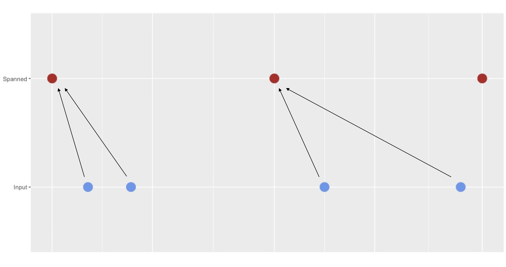

Regarding daylight savings time and different time zones, some explicit choices had to be made. They are explained here, so the user knows what to expect when using the `padr` functions. The last paragraph provides detailed information about the workings of `thicken`.

## Daylight savings time
The `padr` package relies heavily on the base R functions `seq.Date` and `seq.POSIXt` to span the date and datetime variables for `thicken` and `pad` In the latter, choices had to be made about ignoring daylight savings time or not. Take the following example.

```{r, message = FALSE, warning= FALSE, }
start_val <- as.POSIXct('2016-03-25 08:15:00', tz = 'CET')
seq(start_val, by = 'day', length.out = 4) 
seq(start_val, by = 'DSTdays', length.out = 4)
```

As the help file of `seq.POSIXt` mentions: 'The difference between "day" and "DSTday" is that the former ignores changes to/from daylight savings time and the latter takes the same clock time each day.' The interval of a datetime variable in the `padr` context is determined by the lowest time unit that differs over the individual datetime observations. When the hour of the observation shifts as a result of daylight savings time this will cause the interval to change from 'day' to 'hour'. This implies that when we pad a variable that has interval 'day', the daylight savings time can't be ignored and we thus take the same clock time everyday. The only other interval that can be distorted by daylight savings time is 'week'.

```{r}
seq(start_val, by = 'week', length.out = 2)
```

Spanning of variables of this interval is therefore implemented as:

```{r}
seq(start_val, by = '7 DSTdays', length.out = 2)
```

## Different time zones
The arguments `start_val` (in `pad` and `thicken`) and `end_val` (in `pad`) can have a different time zone than the input datetime variable. In this case the function will coerce the argument to be of same time zone as the input variable *while keeping the clock time equal*. It does so with throwing a warning. Take the following example:

```{r}
library(padr)
to_pad <- data.frame(dt = seq(as.POSIXct('2016-02-02 14:53:12', tz = 'CET'),
                                         length.out = 2, by = 'day'))
pad(to_pad, start_val = as.POSIXct('2016-02-01 14:53:12', tz = 'EST'))
```

This behavior was chosen over throwing an error or converting to the other time zone with adjusting the clock time, because it is assumed that the user did not use two time zones on purpose. Time zone differences are more likely due to different object sources, rather than being created intentional. For instance using `as.POSIXct` without specifying the time zone, will use the time zone from the System's locale. When creating a datetime variable with `lubridate` on the other hand, it will use *UTC* as the default time zone. 

## Details working `thicken`

`thicken` takes the interval of the input datetime variable and spans a variable of a higher interval around it. When `rounding` is "down" each value in the input variable will be mapped to the closest value in the spanned variable, that is lower or equal than itself. When `rounding` is "up" this is to the closest value that is larger than itself. Graphically this looks like:



The blue dots are the values of the input datetime variable. The red dots are the timepoints that are spanned around the original time points. In this example the `rounding` is "down", so the original values are mapped to the closest value in spanned, that is earlier than the original.

For all the seven intervals that could be spanned, by default the spanned variable will be as 'tightly' around the input variable as the interval allows. Meaning that the first value of the spanned variable is the latest possible timepoint that is still smaller than the smallest value of the input variable. The last value is the first possible timepoint that is larger than the the largest value of the input variable.

As of version 0.3.0 the user can specify units other than one for each of the interval (e.g. 10 minutes, 2 hours). In order to implement this the default spanning behavior had to change from previous versions. This does not change the result, if the desired interval is of unit one. These are the default start values of the seven intervals that we can `thicken` to. The spanning ends after the last observation in the datetime variable. The first five will be of class `Date`, the last two will be of class `POSIXct`.

* **year** will start on January 1st of the year of the first value of the datetime variable.
* **quarter** will start on one of the following: January 1st, April 1st, July 1st, or October 1st.
* **month** will start on the first day of the month of the first value of the datetime variable.
* **week** will start on a Sunday.
* **day** will start and end on any given day.
* **hour** will start and end on the beginning of the day.
* **minute** will start and end on the beginning of the hour.

